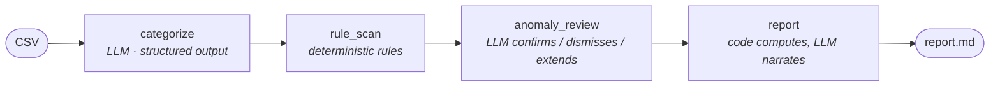

# financial-analysis-agent

[](https://github.com/langchain-ai/langgraph)
[](https://www.python.org/)
[-d97757)](https://docs.claude.com)
[](#development)
[](LICENSE)

A **multi-step LangGraph agent** that reads raw bank transactions (COP), categorizes them with LLM structured outputs, detects anomalies with a **hybrid rules + LLM-reviewer pipeline**, and writes a financial report — **with a public eval suite** that scores the whole pipeline against a labeled dataset.

Built by an engineer who ships digital banking software for a living; the anomaly taxonomy (duplicate charges, masked outliers, silent subscription price jumps, suspicious foreign merchants) comes from real fintech patterns.

## How it works



Design decisions worth reading the code for:

- **The LLM never does math.** Totals, category breakdowns and z-scores are computed in code (`io.py`, `rules.py`); the report step receives the figures and is instructed to use only them.
- **Rules first, LLM as reviewer.** Deterministic rules (duplicate charges, amount outliers) are cheap and explainable — but they over-flag. The LLM reviewer confirms real anomalies, **dismisses false positives** (a fancy restaurant once a month is not fraud) and adds what rules can't see (a 3:47 AM foreign gambling charge, a subscription that silently jumped 67%).
- **Leave-one-out z-scores.** A naive z-score lets an extreme outlier inflate its own group's stdev and mask itself: a 2,450,000 COP utility bill among ~200K bills scores z≈2.4 naively — but z≈25 leave-one-out. `rules.py` implements the latter.
- **Every LLM step returns a validated Pydantic structure.** No free-text parsing anywhere in the pipeline.
- **Conservative merge.** Rule flags the reviewer doesn't explicitly dismiss survive to the final report.
- **TRM enrichment.** Totals get their USD equivalent using Colombia's official exchange rate, via the same public dataset behind my [colombia-finance-mcp](https://github.com/AlejandroGuerra1823/colombia-finance-mcp) MCP server.

## Evals

The agent is scored end-to-end (real model calls) against `evals/dataset.jsonl`: 48 labeled Colombian transactions with 5 planted anomalies of increasing difficulty — from rule-catchable (duplicate charge) to semantic-only (a subscription price jump the rules cannot see) — plus deliberate rule false-positives the reviewer must dismiss.

Results with `claude-opus-5` (2026-10-01, full breakdown in [`evals/RESULTS.md`](evals/RESULTS.md)):

| Metric | Result |
|---|---|
| Categorization accuracy | **95.8%** (46/48) |
| Anomaly precision | **100%** (0 false positives) |
| Anomaly recall | **80%** (4/5) |
| Anomaly F1 | **0.89** |

**Reading the results honestly:** the reviewer dismissed both deliberate rule false-positives (the one-off game purchase and the upscale restaurant) — the hybrid design doing its job. The one "miss" is a judgment call, not a blind spot: for the duplicate charge pair, the agent flagged only the **second** occurrence (the gold labels mark both) — which is arguably what a human analyst would do, since the first charge is the legitimate one. The two misclassifications are genuinely ambiguous merchants (a bakery labeled dining, predicted groceries; the suspicious foreign charge labeled shopping, predicted other — while still being **caught as an anomaly**).

Reproduce: `ANTHROPIC_API_KEY=... uv run python evals/run_evals.py` → rewrites `evals/RESULTS.md` and `evals/sample_report.md` (the generated report).

## Quickstart

Requires [uv](https://docs.astral.sh/uv/) and an [Anthropic API key](https://console.anthropic.com/).

```bash
git clone https://github.com/AlejandroGuerra1823/financial-analysis-agent.git
cd financial-analysis-agent
uv sync

export ANTHROPIC_API_KEY=sk-ant-...
uv run finance-agent data/transactions_sample.csv -o report.md --json results.json
```

Input CSV columns: `date, description, amount_cop` (negative = outflow), optional `id`.
Model defaults to `claude-opus-5`; override with `--model` or `FINANCE_AGENT_MODEL`.

## Development

```bash
uv run pytest        # 8 unit tests — no network, LLM stubbed, TRM monkeypatched
uv run python evals/run_evals.py   # end-to-end evals (real API)
```

## Roadmap

- [ ] Judge-based eval for report quality (LLM-as-judge with a rubric)
- [ ] Multi-currency inputs (USD accounts alongside COP)
- [ ] Budget tracking node (month-over-month category deltas)

## Author

**Alejandro Guerra** — AI Engineer · digital banking
[LinkedIn](https://linkedin.com/in/alejandro-guerra-developer) · [Portfolio](https://alejo-guerra-dev.vercel.app) · [GitHub](https://github.com/AlejandroGuerra1823)

MIT © 2026
